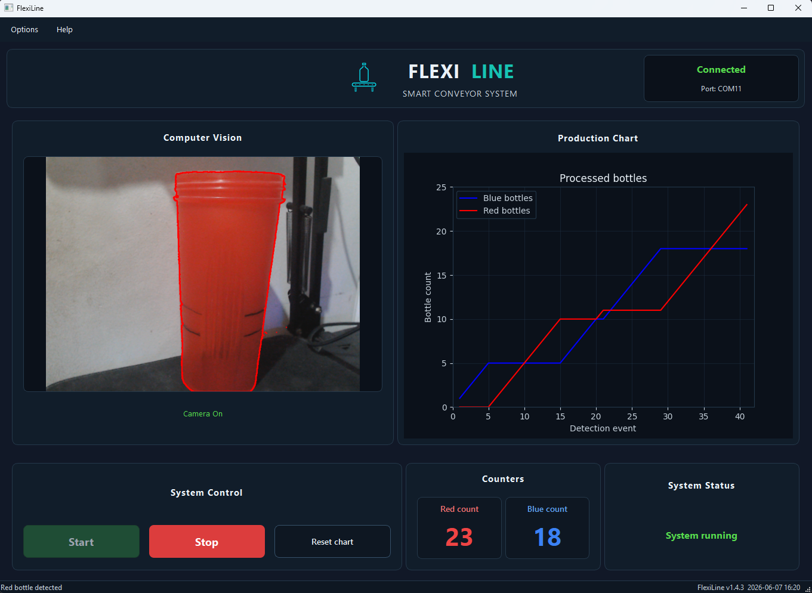
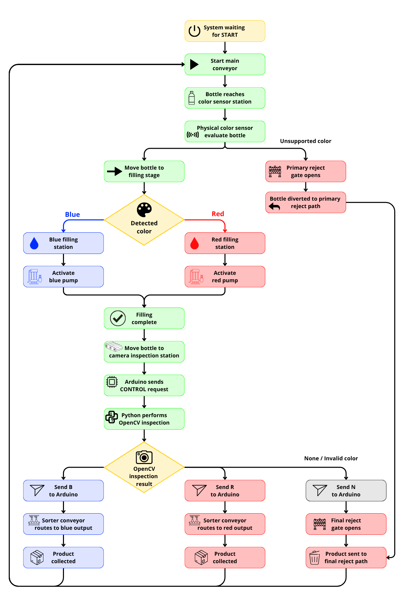

# FlexiLine

**FlexiLine** is a smart conveyor prototype that combines embedded control, optical sensing, computer vision, and a Python desktop dashboard to automate bottle filling, final inspection, and product sorting.

Originally developed as a university project, this repository contains a refactored and improved version focused on cleaner software architecture, better maintainability and a more professional operator interface.

## Dashboard Preview



## Status

**Functional prototype — refactored software and firmware**

The original system was implemented and tested as a university mechatronics project. This repository contains a refactored version with a modular Python desktop application, a redesigned PySide6 dashboard, a PlatformIO-based Arduino firmware structure and an updated serial communication protocol.

The Python dashboard and serial communication flow have been tested using virtual serial ports. The original physical prototype was functional. The refactored version preserves the original production flow while improving maintainability, project structure and documentation.

## Overview

FlexiLine simulates a flexible production line for two variants of liquid. The system identifies the bottle color, activates the appropriate filling process, performs a final inspection using computer vision and routes the final product to the correct output path.

The goal is to reduce manual intervention during product changes by allowing different product variants to be processed in the same automated line.

## Project Goals

The main goal of FlexiLine is to design and implement an automated production line capable of identifying two different bottle colors, filling each bottle with the corresponding liquid detergent and sorting the final products for distribution.

### Specific Objectives

* Design and implement an automatic validation system.
* Design and implement a product dispensing mechanism.
* Develop a final validation stage that allows filled bottles to follow different routes depending on their color.
* Integrate a flexible infrastructure capable of producing different product variants without manual intervention.

## Features

* Real-time camera preview.
* OpenCV-based final color inspection.
* Arduino serial communication.
* Dynamic serial port selection.
* Operator dashboard.
* Production chart.
* Red and blue bottle counters.
* Start, stop, retry camera and reset chart controls.
* Physical color sensing before filling.
* Computer vision validation after filling.
* Modular Python and C++ architecture.

## Workflow

FlexiLine follows an automated production sequence controlled by Arduino and supported by a Python-based computer vision system.

1. Empty bottles are placed on the conveyor line.
2. A physical color sensor detects the bottle color before the filling stage.
3. If the detected color is not supported, the bottle is rejected.
4. If the color is valid, the conveyor moves the bottle to the corresponding filling station.
5. The system verifies that enough liquid is available for the filling process.
6. The appropriate pump or valve is activated depending on the detected bottle color.
7. After the filling delay, the conveyor moves the bottle to the final inspection stage.
8. Arduino sends a `CONTROL` request to the Python application.
9. The Python application uses the camera and OpenCV to perform a final color inspection.
10. Python sends the inspection result back to Arduino.
11. Arduino routes the bottle to the corresponding left or right distribution path.
12. The final product is collected according to its color/product category.


## Process Flow

The following diagram summarizes the complete production sequence, from bottle detection to filling, OpenCV inspection and final sorting.



## System Architecture

FlexiLine is organized around a central production flow where multiple subsystems interact to control transport, sensing, filling, validation and final routing.

The architecture integrates:

* **Transport subsystem**
  Controls the main conveyor and sorting conveyor using motors and directional control logic.

* **Product flow control subsystem**
  Manages the bottle passage and liquid dispensing stage through valves, pumps and filling logic.

* **Color sensing subsystem**
  Uses an optical color sensor to detect the bottle type before filling.

* **Computer vision subsystem**
  Uses a camera and image processing to perform the final inspection stage.

* **Level monitoring subsystem**
  Uses level sensors to monitor liquid availability.

* **Position and rejection subsystem**
  Uses proximity/distance sensing and position control mechanisms to route or reject products depending on the validation result.

## Serial Protocol

The Python application and Arduino firmware communicate through a simple newline-terminated serial protocol.

### Python to Arduino

| Command | Description                             |
| ------- | --------------------------------------- |
| `START` | Starts the conveyor system              |
| `STOP`  | Stops and resets the system             |
| `B`     | Blue bottle detected by computer vision |
| `R`     | Red bottle detected by computer vision  |
| `N`     | No registered color detected            |

### Arduino to Python

| Command   | Description                           |
| --------- | ------------------------------------- |
| `CONTROL` | Requests a computer vision inspection |

## Tech Stack

### Software

* Python
* PySide6
* OpenCV
* Matplotlib
* PySerial

### Firmware

* Arduino / C++
* Arduino state machine
* Serial communication protocol

### Hardware

* Arduino Mega
* USB camera / webcam
* TCS3200 color sensor
* LM393 proximity sensors
* Liquid level sensors
* Gear motors
* BTS7960 H-Bridge motor drivers
* Servomotors
* Solenoid valves / liquid dispensing system
* Conveyor belts
* Custom mechanical frame

## Hardware Components

The original physical prototype was built using the following main components:

| Component                           | Quantity | Purpose                                |
| ----------------------------------- | -------: | -------------------------------------- |
| USB camera / webcam                 |        1 | Image capture for final inspection     |
| TCS3200 color sensor                |        1 | Initial bottle color detection         |
| LM393 proximity sensors             |       10 | Bottle presence and position detection |
| Level sensors                       |        4 | Liquid level monitoring                |
| Gear motors                         |        2 | Conveyor movement                      |
| 1/2" solenoid valves                |        2 | Liquid flow control                    |
| Arduino Mega                        |        1 | Embedded control unit                  |
| Servomotors                         |        4 | Mechanical routing and gate control    |
| BTS7960 H-Bridge drivers            |        2 | Motor direction and power control      |
| Steel square tube support structure |        2 | Mechanical frame                       |
| Tinned cable                        |        2 | Electrical wiring                      |
| Stainless steel sheet, gauge 18     |        2 | Structural and mechanical components   |
| Conveyor belts                      |        3 | Product transport and sorting          |

## Installation

### Prerequisites

Before running the application, make sure you have:

- Python 3.11 or later
- Git
- A connected camera or webcam
- An Arduino board connected through USB
- Arduino firmware uploaded to the board

### Clone the repository

```bash
git clone https://github.com/hiri-code/flexiline-smart-conveyor.git
cd flexiline-smart-conveyor
```

### Create a virtual environment

```bash
python -m venv .venv
```

### Activate the virtual environment.

On Windows:

```bash
.venv\Scripts\activate
```

On macOS/Linux:

```bash
source .venv/bin/activate
```

### Install dependencies:

```bash
pip install -r requirements.txt
```

### Run the application:

```bash
python -m src.main
```

## Usage

1. Connect the Arduino board to the computer.
2. Open the FlexiLine desktop application.
3. Select the correct serial port from the **Options > Ports** menu.
4. Start the system from the dashboard.
5. The Arduino controls the physical production sequence.
6. When final inspection is required, Arduino sends a `CONTROL` request.
7. Python performs camera-based color inspection and sends the result back to Arduino.
8. Arduino routes the bottle according to the inspection result.

## Roadmap

* [x] Create Python application entry point.
* [x] Refactor camera processing module.
* [x] Refactor Arduino serial controller.
* [x] Create PySide6 dashboard interface.
* [x] Add external QSS styling.
* [x] Integrate dashboard with core components.
* [x] Add modular Arduino firmware.
* [ ] Add dashboard screenshots.
* [ ] Complete final project documentation.

## Background

FlexiLine was originally developed as a university mechatronics project focused on automated production systems. The goal was to build a flexible filling line capable of processing different product variants without manually stopping or reconfiguring the system.

The original prototype integrated mechanical design, Arduino-based control, sensors, actuators, liquid dispensing and computer vision. This repository improves that original implementation by applying a cleaner software architecture.

## License

This project is licensed under the MIT License. See [LICENSE](LICENSE) for details.
